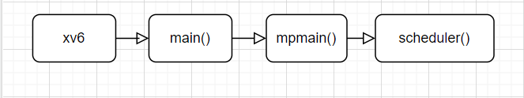

# Objective

+ Improve an original xv6 scheduler with MLFQ and Stride

# An original xv6 scheduler

+ Xv6 uses RR(Round Robin) scheduling as a default scheduling algorithm
+ When a timer interrupt occurs, the currently running process is switched over to the next runnable process
+ The default value set for the tick in xv6 is about 10ms

# Background knowledge and precondition about MLFQ

+ There is a 3-level feedback queue with level 0, 1, 2
+ When a process is newly created, it initially enters the highest priority queue of MLFQ.
+ A process on a higher priority queue is chosen to run
+ Each level of queue applies Round Robin policy with different time quantum
  + The highest priority queue: 1 tick
  + Middle priority queue: 2 ticks
  + The lowest priority queue: 4 ticks
+ Once a process uses up its time allotment at a given level(regardless of how many times it has given up the CPU), it moves down on queue
+ Each queue has a different time allotment
  + The highest priority queue: 5 ticks
  + Middle priority queue: 10 ticks
+ Priority Boost
  + Starvation
    + If there are too many processes in the highest priority queue, processes in lower level queues cannot be run
  + To prevent starvation, priority boosting needs to be performed periodically
  + After some time period S, move all the processes in the queues to the topmost queue
  + Frequency of priority boosting: 100 ticks
+ MLFQ should always occupy at least 20% of the CPU share

# Combine the stride scheduling algorithm with MLFQ

+ Stride scheduling
  + A scheduling mechanism that has been used to guarantee each process obtain a certain percentage of CPU time
+ If a process in MLFQ wants to request a portion of CPU, the process invokes `set_cpu_share` system call which guarantees the calling process to be allocated that much of a CPU time
+ The total sum of CPU share requested from the processes in the stride queue cannot exceed 80% of the total CPU time

# The overall flow

+ How scheduler() is called


+ How process is made and scheduled by scheduler()


+ How process is terminated


# Implementation

1. `proc.h`
+ `struct proc`
```
struct proc {
  int priority; // 0, 1, 2 for MLFQ, -1 for stride scheduling
  int quantum; // quantum of level where process belongs to
  int alloment; // allotment of level where process belongs to
  int tick; // to count how many quantums the process uses
  int spent; // to count how many ticks the process spent to compare with allotment at a given level
  
  int stride; // stride of the process when scheduled by stride scheduling
  int pass; // pass value of the process when scheduled by stride scheduling
};
```
+ Some global variables are added for implementation
```
int mlfq_procnum[3]; // count the number of processes stored on each level
int total_tickets; // the number of tickets remaining after allocating to processes
int min_pass; // minimum pass value of processes scheduled by stride scheduler
int mlfq_stride; // the stride of MLFQ
int mlfq_pass; // the pass value of MLFQ
```

2. `proc.c`
+ `void userinit(void)`
  + `mlfq_init()` and `stride_init()` are added to `userinit()`
```
void
userinit(void)
{
  ...
  ... 
  mlfq_init();
  stride_init();
  p = allocproc();
  ...
  ...
} 
```

+ `void mlfq_init(void)`
  + Initialize the number of processes of each level
  + Because the first 3 processes are not scheduled, `mlfq_procnum[0]` starts with -3
```
void
mlfq_init(void)
{
  for(int i = 0; i < 3; i++)
    mlfq_procnum[i] = 0;
  mlfq_procnum[0] = -3;
}
```

+ `void stride_init(void)`
  + Initialize global values needed for stride scheduling
  + The total amount of tickets is 100
  + The pass value of process which is not scheduled by stride scheduling is -1
```
void
stride_init(void)
{
  total_tickets = 100;
  min_pass = 0;
  mlfq_stride = 0;
  mlfq_pass = 0;
  struct proc* p;
  for(p = ptable.proc; p < &ptable.proc[NPROC]; p++) {
    p->pass = -1;
  }
}
```

+ `static struct proc* allocproc(void)`
  + When allocating a process, set the additional options about MLFQ
```
static struct proc*
allocproc(void)
{
  ...
  ...
  mlfq_setting(p, 0);
  return p;
}
```

+ `void mlfq_setting(struct proc* p, int priority)`
  + Set the member variables of a given process according to a given priority
  + Also, calculate the number of processes on each level
```
void
mlfq_setting(struct proc* p, int priority) {
  int quantums[3] = {1, 2, 4};
  int allotments[3] = {5, 10, __INT_MAX__};

  //when called by set_cpu_share
  if(priority == -1) {
    mlfq_procnum[p->priority]--;
    p->priority = priority;
    p->quantum = 0;
    p->allotment = 0;
    p->spent = 0;
    p->tick = 0;
    return;
  }

  //when called by allocproc
  if(priority == 0) {
    mlfq_procnum[0]++;
  }
  //when called by mlfq_scheduler
  else {
    mlfq_procnum[priority]++;
    mlfq_procnum[p->priority]--;
  }

  p->priority = priority;
  p->quantum = quantums[priority];
  p->allotment = allotments[priority];
  p->spent = 0;
  p->tick = 0;
  p->stride = -1;
  p->pass = -1;
} 
```

+ `void mlfq_scheduler(struct proc* p)`
  + Once a process uses up its time allotment at a given level, it moves down on queue

```
void
mlfq_scheduler(struct proc* p)
{
  if(p->spent == p->allotment) {
    if(p->priority == 0) {
      mlfq_setting(p, 1);
    }
    else if(p->priority == 1) {
      mlfq_setting(p, 2);
    }
  }
}
```

+ `void priority_boosting(void)`
  + In every 100 ticks, move all the processes in the queues to the topmost queue
  + Boost only processes which are scheduled by MLFQ
  + Member variables about stride scheduling are all -1
```
void
priority_boosting(void)
{
  if(ticks % 100 == 0 && ticks > 0) {
    struct proc* boosted_proc;
    for(boosted_proc = ptable.proc; boosted_proc < &ptable.proc[NPROC]; boosted_proc++) {
      if(boosted_proc->priority == -1 || (boosted_proc->state != RUNNABLE && boosted_proc->state != RUNNING))
        continue;
     
      mlfq_procnum[boosted_proc->priority]--; // substract the procnum of level where the process belongs to
      mlfq_procnum[0]++; // add the procnum in level[0]
      boosted_proc->priority = 0;
      boosted_proc->quantum = 1;
      boosted_proc->allotment = 5;
      boosted_proc->spent = 0;
      boosted_proc->tick = 0;
      boosted_proc->stride = -1;
      boosted_proc->pass = -1;
    }
  }
}
```

+ `int set_cpu_share(int ticket)`
  + `total_tickets` was first initialized with 100 in `stride_init()`
  + `mlfq_stride` and `mlfq_pass` were first initialized with 0 in `stride_init()`
  + Assume that MLFQ is also a process and assign tickets(also applied to stride and pass value)
  + When set_cpu_share() invoked, assign tickets as requested by the calling process and then assign MLFQ the remaining tiekcts
  + If the percentage of tickets allocated to MLFQ is less than 20%, exception handling is needed(return -1)
  + Also, if the inquired percentage of tickets is 0 or negative number, exception handling is needed(return -1)
  
```
int
set_cpu_share(int ticket)
{
  total_tickets -= ticket;

  //exception handling to guarantee at least 20% CPU time to MLFQ
  if(total_tickets < 20 || ticket <= 0) {
    total_tickets += ticket;
    return -1;
  }
  int stride = 100 / ticket;
  myproc()->stride = stride;
  myproc()->pass = min_pass;
  mlfq_setting(myproc(), -1); // MLFQ -> Stride
  int mlfq_ticket = total_tickets;
  mlfq_stride = 100 / mlfq_ticket;
  return 0;
}
```

+ `void find_min_pass(void)`
  + find the minimum pass value among processes scheduled by stride scheduler
  + `min_pass` was first initialized with 0 in `stride_init()`
```
void
find_min_pass(void)
{
  struct proc* p;
  int min = __INT_MAX__;
  for(p = ptable.proc; p < &ptable.proc[NPROC]; p++) {
    int pass = p->pass;
    if(pass != -1 && pass <= min) {
      min = pass;
    }
  }
  min_pass = min;
} 
```

+ `void scheduler(void)`
  + For every 5,000 ticks, schedule every process in ptable because there are some cases that the scheduler does not schedule certain processes
  + Compare `min_pass` and `mlfq_pass` and schedule a process on the lower side of the value
  + In MLFQ, a process on a higher priority queue is chosen to run
  + In stride, a process which has the lowest pass value is chosen to run 
```
void
scheduler(void)
{
  struct proc *p;
  struct cpu *c = mycpu();
  c->proc = 0;

  for(;;) {
    sti();

    acquire(&ptable.lock);
    for(p = ptable.proc; p < &ptable.proc[NPROC]; p++) {
      if(p->state == RUNNABLE && (0 <= ticks % 5000 && ticks % 5000 <=63)){
        // For every 5,000 ticks, schedule every process in ptable
        goto found;
      }
      if(min_pass >= mlfq_pass) { // should schedule a process in MLFQ
        if(p->state == RUNNABLE && p->priority == 2 && mlfq_procnum[0] == 0 && mlfq_procnum[1] == 0) { // Scheduling a process at lev[2]
          mlfq_pass += mlfq_stride;
          goto found;
        }
        else if(p->state == RUNNABLE && p->priority == 1 && mlfq_procnum[0] == 0) { // Scheduling a process at lev[1]
          mlfq_pass += mlfq_stride;
          goto found;
        }
        else if(p->state == RUNNABLE && p->priority == 0) { // Scheduling a process at lev[0]
          mlfq_pass += mlfq_stride;
          goto found;
        }
        else {
          continue;
        }
      }
      else { // should schedule a process in stride
        if(p->state == RUNNABLE && p->priority == -1) { 
          if(p->pass == min_pass) {
            p->pass += p->stride;
            find_min_pass(); // Updating the minimum pass value
            goto found;
          }
          else {
            continue;
          }
        }

        else {
          continue;
        }
      }
      found:
        c->proc = p;

        switchuvm(p);
        p->state = RUNNING;

        swtch(&(c->scheduler), p->context);
        switchkvm();

        c->proc = 0;
    }
    release(&ptable.lock);
  }
} 
```

+ `void exit(void)`
  + If a process in MLFQ exits, substract the procnum of level where the process belongs to
  + If a process in stride exits, give MLFQ tickets which were allocated to the terminating process
```
void
exit(void)
{
  ...

  if(curproc->priority == 0 || curproc->priority == 1 || curproc->priority == 2) {
    mlfq_procnum[curproc->priority]--;
  }
  if(curproc->priority == -1) {
    total_tickets += (100 / curproc->stride);
    int mlfq_ticket = total_tickets;
    mlfq_stride = 100 / mlfq_ticket;
    find_min_pass();
  } 

  ...
}
```

3. `trap.c`

+ `void trap(struct trapframe* tf)`
  + When timer interrupt occurs,
    + Implement priority boost if needed(in every 100 ticks)
    + With a process in MLFQ, add `spent` and `tick`, and use mlfq_scheduler() to move down to the lower queue if needed
    + With a process in stride, add `tick`
  + yield
    + With a process in MLFQ, if (process's tick) >= (time quantum of a queue level where the process belongs to), call `yield()`
    + With a process in stride, follow the speed of MLFQ to match the yielding proportion
```
void
trap(struct trapframe* tf)
{
...
   case T_IRQ0 + IRQ_TIMER:
     if(cpuid() == 0){
       acquire(&tickslock);
       ticks++;
       priority_boosting();
 
       if(myproc() && (myproc()->priority == 0 || myproc()->priority == 1 || myproc()->priority == 2)) {
         (myproc()->tick)++;
         (myproc()->spent)++;
         mlfq_scheduler(myproc());
       }
       if(myproc() && myproc()->priority == -1) {
         (myproc()->tick)++;
       }
       wakeup(&ticks);
       release(&tickslock);
     }
...

... 

  if(myproc() && myproc()->state == RUNNING && tf->trapno == T_IRQ0+IRQ_TIMER) {
    if((myproc()->priority == 0 || myproc()->priority == 1 || myproc()->priority == 2) && myproc()->tick >= myproc()->quantum) { // MLFQ
      myproc()->tick = 0;
      yield();
    }
    if(myproc()->priority == -1) { // stride
      if(mlfq_procnum[0] != 0 && myproc()->tick >= 1) {
        myproc()->tick = 0;
        yield();
      }
      else if(mlfq_procnum[0] == 0 && mlfq_procnum[1] != 0 && myproc()->tick >= 2) {
        myproc()->tick = 0;
        yield();
      }
      else if(mlfq_procnum[0] == 0 && mlfq_procnum[1] == 0 && mlfq_procnum[2] != 0 && myproc()->tick >= 4) {
        myproc()->tick = 0;
        yield();
      }
    }
  } 
}
```

4. sysproc.c

+ `int sys_yield(void)`
  + This system call is called only by process user before a tick is done
  + To solve a gaming problem, add `spent` and `tick`, and use mlfq_scheduler() to move down to the lower queue if needed
  + In this way, regardless of how many times the process has given up the CPU, a process cannot stay in the high level of a MLFQ for as long as the user wants
```
int
sys_yield(void)
{
  myproc()->tick++;
  myproc()->spent++;
  mlfq_scheduler(myproc());
  yield();
  return 0;
}
```

# Examples of execution

1. Stride 5%, Stride 15%, MLFQ_LEVCNT, MLFQ_NONE
+ Test results

+ Results analysis
  + Stride 5%: -0.2% error occurred
  + Stride 15%: +0.1% error occurred
  + An actual result of an example is almost consistent with the expected result

round off to the nearest tenth

2. Stride 5%, Stride 10%, Stride 15%, MLFQ_LEVCNT, MLFQ_NONE
+ Test results

+ Results analysis
  + Stride 5%: -0.5% error occurred
  + Stride 10%: -1.9% error occurred 
  + Stride 15%: -1.7% error occurred
  + An actual result of an example is not as accurate as Example 1, but still almost consistent with the expected result

round off to the nearest tenth

3. Stride 50%, Stride 35%, MLFQ_LEVCNT, MLFQ_NONE
+ Test results

+ Results analysis
  + Stride 50%: +3.4% error occurred
  + Stride 35%: FAIL
  + The total sum of CPU share requested from the processes in the stride queue cannot exceed 80% of the total CPU time
  + An error rate of 'Stride 50%' have increased slightly than Example 1 and Example 2, but not so much

round off to the nearest tenth

4. Stride 10%, Stride 20%, MLFQ_LEVCNT_YIELD, MLFQ_NONE
+ Test results

+ Results analysis
  + Stride 10%: +4.72% error occurred
  + Stride 20%: +7.62% error occurred
  + Processes yielded by process user relatively gain a smaller percentage of CPU time
  + Error rates of 'Stride 10%' and 'Stride 20%' have increased compare to the previous examples
round off to the nearest hundredth

# Scheduler performance evaluation
+ MLFQ
  + When a process is newly created, it initially enters the MLFQ
  + Each level of queue adopts a RR policy with different time quantum
  + When a process uses up its time allotment at a given level, its priority is reduced
  + The above condition is satisfied regardless of how many times the process has given up the CPU voluntarily by making 'yield() system call' proper
  + However, processes yielded by process user relatively gain a smaller percentage of CPU time
  + Priority boosting is executed in every 100 ticks
  + MLFQ always occupy at least 20% of the CPU share thanks to an exception handling in set_cpu_share()
+ Stride
  + The process in MLFQ which invokes set_cpu_share() is managed by the stride scheduler generally
  + A share of CPU time works well on demand
  + An exception handling for set_cpu_share() works well
    1. Inquiring more than 80% of CPU time to Stride scheduling
    2. Inquiring 0 or negative number of a cpu share
# Limitation
+ For every 5,000 ticks, scheduler() schedules every process in ptable because there are some cases that the scheduler does not schedule certain processes
  + If there exists an improved method, error rates will be further reduced
+ When calculating stride value for each process,
  + My scheduler divides (int type) by (int type) and it can increase error rates because the stride value is just an integer quotient
  + If the scheduler increase the total tickets, or use float/double type for stride value, error rates will be further reduced
+ When finding the minimum pass value,
  + My scheduler finds the minimum pass value with linear complexity O(n)
  + If the scheduler use 'priority queue' or 'heap', the complexity can be reduced to O(logn)
