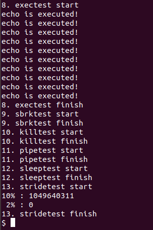

# Objective of milestone03
+ Interaction with other services in xv6 using LWP

# Basic LWP operations
+ `int thread_create(thread_t *thread, void *(*start_routine)(void*), void *arg)`
+ `void thread_exit(void *retval)`
+ `int thread_join(thread_t thread, void **retval)`
+ Refer to wiki of Milestone02

# Exit
+ All LWPs are terminated and all resources used for each LWP must be cleaned up, and the kernel should be able to reuse it at a later point of time

```c
if(curproc->lwp_master_pid > 0) {
  release(&ptable.lock);
}
```
+ If `curproc` is an LWP, without considering other LWPs in the same group, only itself follows the `exit()`'s routine

```c
else if(curproc->lwp_master_pid == 0){
  int master_pid = curproc->pid;
  int lwp_cnt = 0;
  for(p = ptable.proc; p < &ptable.proc[NPROC]; p++) {
    if(p->lwp_master_pid == master_pid) {
      lwp_cnt++;
    }
  }

  for(;;) {
    for(p = ptable.proc; p < &ptable.proc[NPROC]; p++) {
      if(p->lwp_master_pid == master_pid) {
        if(p->state != ZOMBIE) {
          p->killed = 1;
          wakeup1(p);
        }
        else {
          // clean up page table allocated memories, and stack of the LWP
          kfree(p->kstack);
          p->kstack = 0;
          p->sz = deallocuvm(p->pgdir, p->stack_base + 2 * PGSIZE, p->stack_base); // instead of freevm in wait()
          curproc->jsb.addr[curproc->jsb.cnt++] = p->stack_base;
          p->pid = 0;
          p->parent = 0;
          p->name[0] = 0;
          p->killed = 0;
          p->state = UNUSED;

          p->lwpid = 0;
          p->lwp_master_pid = 0;
          p->master = 0;
          p->retval = 0;
          p->stack_base = 0;
          lwp_cnt--;
          if(lwp_cnt == 0) {
            break;
          }
        }
      }
    }
    if(lwp_cnt == 0) {
      release(&ptable.lock);
      break;
    }
    sleep(curproc, &ptable.lock);
  }
}
```
+ If `curproc` is a normal process, 
+ By looping over `ptable`, count the number of LWPs belonging to this process
+ In for(;;) loop, find the LWPs belonging to this process
  + If `p->state != ZOMBIE`, set `p->killed` to 1 and `wakeup1(p)`
  + Then, trap will catch the process's flag `killed`
  + In this way, no LWP survive for a long time after exit system call is executed
  + Else(`p->state == ZOMBIE`), clean up page table allocated memories, and stack of the LWP
  + If all of LWPs in the group are cleaned up, break the `for(;;)` loop
  + Every time after looping over the whole table, put the current process to sleep(`sleep(curproc, &ptable.lock)`)
+ When cleaning up, the kernel should be able to reuse it at a later point of time

```c
if(curproc->lwp_master_pid > 0) {
  if(curproc->killed == 0) {
    curproc->master->killed = 1;
  }
  wakeup1(curproc->master);
}
```
+ If `curproc` is an LWP, 
+ Master might be sleeping in `wait()`
  + Wakeup the sleeping master process
+ If calling LWP is not killed yet, set `master->killed` to 1
  + Then, trap will catch the process's flag `killed`

+ The codes that are not mentioned are the same as those of the existing `exit()`

# Fork
+ A new process must be created according to the fork's behavior, and the address space of the LWP must be copied normally

```c
  if(curproc->lwp_master_pid == 0) { // If a normal process calls fork(), fork a new process in the same way
    if((np->pgdir = copyuvm(curproc->pgdir, curproc->sz)) == 0) {
      kfree(np->kstack);
      np->kstack = 0;
      np->state = UNUSED;
      return -1;
    }
  }
  else if(curproc->lwp_master_pid > 0) { // If an LWP calls fork(), copy the pgdir of master
    if((np->pgdir = copyuvm(curproc->master->pgdir, curproc->master->sz)) == 0) {
      kfree(np->kstack);
      np->kstack = 0;
      np->state = UNUSED;
      return -1;
    }
  }
  else { // If curproc->lwp_master_pid < 0, exception handling is needed
    kfree(np->kstack);
    np->kstack = 0;
    np->state = UNUSED;
    cprintf("lwp_master_pid cannot be negative\n");
    return -1;
  }
```
+ After `allocproc`, check if `curproc` is an LWP or not
+ If `curproc` is a normal process, copy `curproc`'s `pgdir`
+ Else if `curproc` is an LWP, copy `master`'s `pgdir`
+ Else(`lwp_master_pid < 0`), exception handling is needed

```c
np->sz = curproc->sz;
if(curproc->lwp_master_pid > 0) {
  np->sz = curproc->master->sz;
}
```
+ After copying proper `pgdir`, update `np->sz` according to which `pgdir` I copied

+ The codes that are not mentioned are the same as those of the existing `fork()`

# Exec
+ The resources of all LWPs are cleaned up so that the image of another program can be loaded and executed normally in one LWP
+ At this time, the process executed by the exec must be guaranteed to be executed as a general process thereafter

```c
if(curproc->lwp_master_pid == 0) {
  freevm(oldpgdir);
}
```
+ If `curproc` is an LWP, I should not free the `oldpgdir`
  + It is because, `oldpgdir` was not only used for `curproc`, but is also still used for LWP group where `curproc` belonged to
+ I should clean up the remaining LWPs, but I am not sure which data to clean up or not. I tried a number of different cases, but many errors have occured. So I decide to clean up nothing.

+ The codes that are not mentioned are the same as those of the existing `exec()`

# Sbrk
+ The expanded memory area must be shared among LWPs

```c
int
sys_sbrk(void)
{
  int addr;
  int n;

  if(argint(0, &n) < 0)
    return -1;
  //addr = myproc()->sz;
  if(growproc(n) < 0)
    return -1;

  addr = myproc()->sz - n;

  return addr;
}
```
+ An original `sys_sbrk` set return value(`addr`) before `growproc()`
+ But when multiple LWPs simultaneously call the `sbrk`, memory areas must not be allocated to overlap with each other
  + So, it is a safer way to set a return value(`addr`) after `growproc()`

```c
int
growproc(int n)
{
  uint sz;
  struct proc *curproc = myproc();

  acquire(&growproc_lock);
  sz = curproc->sz;
  if(curproc->lwp_master_pid > 0) {
    sz = curproc->master->sz;
  }
  if(n > 0){
    if((sz = allocuvm(curproc->pgdir, sz, sz + n)) == 0)
      return -1;
  } else if(n < 0){
    if((sz = deallocuvm(curproc->pgdir, sz, sz + n)) == 0)
      return -1;
  }
  curproc->sz = sz;
  if(curproc->lwp_master_pid > 0) {
    curproc->master->sz = sz;
  }
  switchuvm(curproc);
  release(&growproc_lock);
  return 0;
}
```
+ Not to allocate memory areas to be overlapped with each other, new lock `growproc_lock` is used
+ If `curproc` is an LWP, both `curproc->sz` and `master->sz` should be set the same
+ Also, set the other LWP's `sz` in the same group the same
  + LWPs should not be allocated a space of a different size from the requested size
  + The expanded memory area must be shared among LWPs

# Kill
+ If more than one LWP is killed, all LWPs must be terminated and the resources for each LWPs in that process must be cleaned up

```c
int
kill(int pid)
{
  struct proc *p;
  struct proc *proc_to_kill;

  acquire(&ptable.lock);
  for(p = ptable.proc; p < &ptable.proc[NPROC]; p++){
    if(p->pid == pid){
      if(p->lwp_master_pid > 0) {
        proc_to_kill = p->master;
      }
      else if(p->lwp_master_pid == 0){
        proc_to_kill = p;
      }
      else {
        cprintf("lwp_master_pid cannot be negative\n");
        return -1;
      }
      proc_to_kill->killed = 1;
      // Wake process from sleep if necessary.
      if(proc_to_kill->state == SLEEPING)
        proc_to_kill->state = RUNNABLE;
      release(&ptable.lock);
      return 0;
    }
  }
  release(&ptable.lock);
  return -1;
} 
```
+ If calling process is a normal process, kill the process in the same way as an original `kill()` does
+ If calling process is an LWP, kill the master process in the same way as an original `kill()` does
+ After a kill for an LWP is called, no LWP in that group survive for a long time
  + Thanks to trap, processes whose `killed` flag is 1 will exit() soon

# Pipe
+ All LWPs must share a pipe
+ Can be implemented in a way an original xv6 does

# Sleep
+ Only the requested LWP should be sleeping for the requested time
+ Can be implemented in a way an original xv6 does

# Scheduler
+ MLFQ
```c
void
mlfq_setting(struct proc* p, int priority) {
  int quantums[3] = {5, 10, 20};
  int allotments[3] = {20, 40, __INT_MAX__};
  ...
}
```
  + Each level of the queue adopts RR policy with different time quantum
    + The highest priority queue: 5 ticks
    + Middle priority queue: 10 ticks
    + The lowest priority queue: 20 ticks
  + Each queue has different time allotment
    + The highest priority queue: 20 ticks
    + Middle priority queue: 40 ticks
```c
void
priority_boosting(void)
{   
  if(ticks % 200 == 0 && ticks > 0) {
    ...
  }
}
```
  + To prevent starvation, priority boosting is needed for every 200 ticks

+ Stride
```c
if(myproc() && myproc()->state == RUNNING && tf->trapno == T_IRQ0+IRQ_TIMER) {
  ...
  ...
  if(myproc()->priority == -1 && myproc()->tick >= 5) { // stride
    myproc()->tick = 0;
    yield();
  }
  ...
  ...
}
```
  + The default time quantum is 5 ticks

# Test Result



+ It seems to be working well except stridetest
